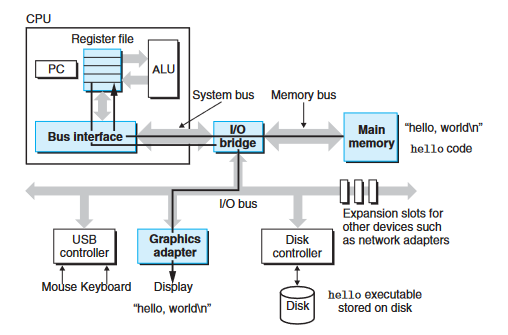

# Information in Bits (+ Context)

The authors of the book specifically tell us the usefulness of studying this topic, for an instance:

> You are going to learn practical skills such as how to avoid strange numerical errors caused by the way that computers represent numbers. You will learn how to optimize your C code by using clever tricks that exploit the designs of modern  processors and memory systems. You will learn how the compiler implements  procedure calls and how to use this knowledge to avoid the security holes from  buffer overflow vulnerabilities that plague network and Internet software. You will learn how to recognize and avoid the nasty errors during linking that confound the average programmer. You will learn how to write your own Unix shell, your own dynamic storage allocation package, and even your own Web server. You will  learn the promises and pitfalls of concurrency, a topic of increasing importance as  multiple processor cores are integrated onto single chips.

_So there is **a lot** to learn_...

This section will be using the classic `hello world` program to demonstrate how information is stored in bits and how computers deal with it all.

The `hello world` program:

```c
#include <stdio.h>

int main() 
{
	printf("hello, world\n");
}
```

^6f42cd

The ` hello world ` program, begins it's life as _source code_ (or _source file_/_source program_) that the programmer creates with an editor and saves in a file (example: ` hello.c `).

***REMARK***: I believe that many programmers don't even comprehend that they are just writing _text_ until they are told so. Be sure to remember, the source code you write is just _text_ written in a special manner, it's not something special until you decide to give it to  a compiler or an intepreter that reads it and makes sense out of it. A program written in _C_ may as well be saved with no extension or with with whatever extension you want to save it with. The ` .c ` extension is just convention.

The _source program_ is a sequence of bits, each with a value of either _1_ or _0_, which are organised into 8-bit chunks called _bytes_. Each byte represents some text character in the program.

Most modern computers represent text characters using the **ASCII standard** that represents each character with a unique byte-sized integer value. For example, the character ` # `, in ASCII, has the integer value of _35_. 

The book is telling us all of this, to essentially inform us that _all information used by computers is represented as a bunch of bits, **the only thing that distinguishes different data objects is the ==context== in which you view them**_. 

As programmers, we need to understand machine representations of numbers because they are not the same as integers and real numbers. They are finite  approximations that can behave in unexpected ways.

Here's a representation of the ` hello.c ` program in ASCII:


# The Compilation System: A Short Overview
I'll take the liberty of combining a bunch of the sections in this first chapter and making it into a general blob of information, since I think it'll be much easier to digest.

The _[[#^6f42cd| hello.c ]]_ program we had a look at in the last section is what we'll call a _high-level C program_. (High does not refer to the complexity but it's level of abstraction), since it can be read and understood (to some degree) by humans.

In order to run this program on a computer, we'll need to translate it into _low-level machine code_. To do this, we use something called a compilation system (which, basically, is just another program). The machine instructions are packaged into a form called _executable object program_ and stored as binary disk file. Object programs are also referred to as _executable object files_.

On a UNIX system, the translation from source file to object file is performed by a _compilation driver_ (example ` gcc `, ` tcc `, ` clang `, and many more ).


Say, you run the following command to compile your program using ` gcc ` on a UNIX system: 
```console
unix> gcc -o hello hello.c
```

Here, the ` gcc ` compiler driver reads the source file ` hello.c ` and translates it into an _executable object file_ ` hello `. The programs that perform the 4 phases, i.e. _preprocessor, compiler, assembler, and linker_, are collectively known as the ***compilation system***. 

- ***Preprocessing Phase***
	- The preprocessor, ` cpp ` (short for _c-pre-processor_ not _c++_), modifies the original C program according to the directives that begin with the _#_ character. 
	- For an example, the `#include<stdio.h>` line tells the preprocessor to read the contents of the header file `stdio.h` and insert it's contents directly into the program file. 
	- This results in another C program file, typically with a ` .i ` suffix.
- ***Compilation Phase***
	- The compiler, ` cc1 `, translates the text file ` hello.i ` into ` hello.s `, which is an _assembly language program_. Each statement in an assembly-language program exactly describes one low-level machine-language instruction in a standard text form.
	- Assembly language is useful because it provides a common output language for different compilers for different high-level languages.
- ***Assembly Phase***
	- The assembler, ` as `, translates the file: ` hello.s ` into machine language instructions, and packages them into a form called _relocatable object program_, and stores the result into an _object file_, which in this case is ` hello.o `.
	- The file ` hello.o ` is a binary file, whose bytes encode machine language instructions rather than characters. So if you looked into the file's contents, it'd look like absolute gibberish.
- ***Linking Phase***
	-  If you look carefully, the program makes use of the ` printf ` function, which is a part of the _standard C library_ provided by every C compiler. 
	- The ` printf ` function resides in a separate precompiled object file called `printf.o`, which somehow be merged with our ` hello ` file, which is an _executable object file_ (a more usual term is: _an executable_) that is ready to be loaded into memory and executed by the system.

There are several advantages if you understand the compilation system and how it works. You'll need this knowledge to _optimize program performance_, _understand link-time errors_, _avoid security loopholes_, and much more.

### Processors Read and Interpret Instructions Stored in Memory
Thus far, we have compiled our program: ` hello.c ` into an executable, and now comes the part where we run the program. To do this on a UNIX system:

```console
unix> ./hello
hello, world
unix>
```

What we're using here is something called a _shell_. ==The shell is a command-line interpreter that prints a prompt, waits for you to type a command line, and then performs the command==. Here, the shell simply loads the `hello` executable and waits for it to finish it's process. Once the executable process terminates, the shell prints the prompt and waits for the user to enter the next command.

It's recommended that you check the next topic's file [[Hardware Organization of a System]] and then return to this page.

#### Returning the ` hello ` program

Initially, the shell program is executing its instructions, waiting for us to type a command. As we type the characters `./hello` at the keyboard, the shell program reads each one into a register, and then stores it in memory:


When `enter` key is pressed, the command is passed onto the shell to execute and it loads the `hello` executable. It does so by executing a set of instructions that _copies the data in hello object file from disk to main memory_. Using a technique known as _[[Bibliography#^379d84|direct memory access (DMA)]]_, the data travels directly from disk to the main memory, _without passing through the processor_:


Once this is done, the processor begins executing the machine-language instructions in the `hello` program's `main` routine:



