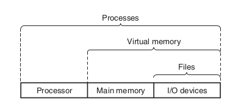

Before proceeding, it is important to note that this topic is very vast and itself constitutes an area of study. What's discussed here is but an overview, an introduction. 

> Back to our `hello` program

When the shell loaded and ran the `hello` program, and whatever happened during and after the process, it was all handeled by the services provided by the _operating system_. The operating system provides a layer of abstraction, imposed between the software components and the hardware components, for ease of use and access. Let's define what _abstraction_ means first.

***Definition***: Abstraction (from the Latin _abs_, meaning _away from_ and _trahere_, meaning _to draw_, resulting in _to draw away from_) is the process of taking away or removing characteristics from something in order to reduce it to a set of essential characteristics.

In simpler words, _abstraction is a process where you remove irrevalant details from a (set of) descriptions so as to make said (set of) descriptions easier to process, comprehend and use._

The operating system has 2 primary purposes:

1. To protect the hardware from misuse by runaway applications.
2. To provide applications with simple and uniform mechanisms for manupulating complicated and often wildly different low-level hardware devices.

This is achieved by the operating system via the use of the following _fundamental abstractions_:

| Object                                 | Abstraction    |
| -------------------------------------- | -------------- |
| I/O devices                            | Files          |
| Main memory and I/O devices            | Virtual Memory |
| Processor, Main memory and I/O devices | Processes      |

As mentioned by the table and can be seen in the diagram above, _files_ are an abstraction for _I/O devices_, _virtual memory_ is an abstraction for _both I/O devices and main memory_, and _processes_ are an abstraction for  the _processor, main memory and I/O devices_. Let's have a look at each of these in turn:

### Processes

