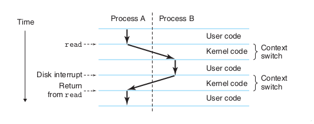
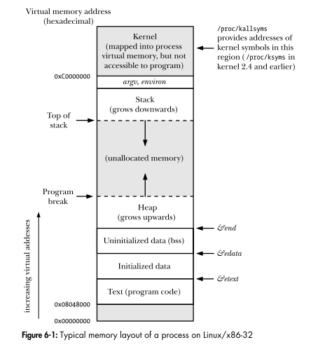

Before proceeding, it is important to note that this topic is very vast and itself constitutes an area of study. What's discussed here is but an overview, an introduction. 

> Back to our `hello` program

When the shell loaded and ran the `hello` program, and whatever happened during and after the process, it was all handeled by the services provided by the _operating system_. The operating system provides a layer of abstraction, imposed between the software components and the hardware components, for ease of use and access. Let's define what _abstraction_ means first.

***Definition***: Abstraction (from the Latin _abs_, meaning _away from_ and _trahere_, meaning _to draw_, resulting in _to draw away from_) is the process of taking away or removing characteristics from something in order to reduce it to a set of essential characteristics.

In simpler words, _abstraction is a process where you remove irrevalant details from a (set of) descriptions so as to make said (set of) descriptions easier to process, comprehend and use._

The operating system has 2 primary purposes:

1. To protect the hardware from misuse by runaway applications.
2. To provide applications with simple and uniform mechanisms for manupulating complicated and often wildly different low-level hardware devices.

This is achieved by the operating system via the use of the following _fundamental abstractions_:

| Object                                 | Abstraction    |
| -------------------------------------- | -------------- |
| I/O devices                            | Files          |
| Main memory and I/O devices            | Virtual Memory |
| Processor, Main memory and I/O devices | Processes      |

As mentioned by the table and can be seen in the diagram above, _files_ are an abstraction for _I/O devices_, _virtual memory_ is an abstraction for _both I/O devices and main memory_, and _processes_ are an abstraction for  the _processor, main memory and I/O devices_. Let's have a look at each of these in turn:

### Processes

When a program such as `hello` runs on a modern system, the ==operating system provides the illusion that the program is the only one running on the system.== This illusion is provided by the notion of processes. 

***Definition***: A _process_ is the operating system's abstraction for a running program.

Multiple processes can run _concurrently_ on the same system, each process appears to have exclusive use of the hardware. By _concurrently_, we mean that the instructions of one process are interleaved with the instructions of another.

A single-core CPU can appear to execute multiple processes concurrently by having the processor switch among them. The OS does this by a mechanism called _context switching_. The operating system keeps track of all the state information that the process needs in order to run. This state, which is known as _context_, inlcudes information such as the current values of the PC, the register file, and the contents of main method.

At any point in time, a uniprocessor system can only execute the code for a single process. When the operating system decides to transfer control from the current process to some new process, it performs a _context switch_ by saving the _context_ of the current process, restoring the _context_ of the new process, and then passing control to the new process. The new process picks up exactly where it left off. Here's a diagram showing the context switching for the `hello` program.

In this scenario, there are 2 concurrent processes running: the `shell` process and the `hello` process. Initially, the shell process is the sole running process, waiting for input from the command line.  When we ask it to run the `hello` program, ==the `shell` does this by invoking a special function known as a "_system call_" that passes control to the OS==. The following takes place after the _syscall_ (system-call) is invoke:
- The OS saves the `shell`'s  context
- The OS creates a new `hello` _process_ and _context_, then,
- The control is passed to the new `hello` process.
- After `hello` terminates, the OS restores the context of the `shell` process and passes control back to it, where it awaits command-line input once again.

Implementing the process abstraction requires close cooperation between both low-level hardware and the OS.

### Threads

In modern systems, a process can actually consist of multiple execution units, called _threads_, ==each running in the context of the process and sharing the same code and global data==. It is easier to share data between multiple threads than between multiple processes, and since ==_threads are typically more efficient than processes_==, they are becoming an increasingly important aspect of programming as a whole. _Multi-threading_ is one way to make programs run faster when multiple processors are available. 

[[Concurrency]] in modern systems makes great use of _threads_, and many programming languages, most notably _Go_, provide in-built support for multi-threading.[^1]

### Virtual Memory

_Virtual memory_ is an abstraction that provides each process with the illusion that it has exclusive use of the main memory. ==Each process has the same uniform view of memory, which is known as its _virtual address space_==. The virtual address space for linux system processes is:

In Linux, the topmost region of the address space is reserved fpr code and data in the operating system that is common to all processes. The lower regions of the address space holds the code and data defined by the user's process. Here's an overview of each section of the virtual address space:

- ***Program Code and Data***: Code begins at the same fixed address for all processes, followed by data locations that correspond to _global C variables_[^2]. The data areas are initialized directly from the contents of an _executable object file_ (or simply an _executable_).
- ***Heap***: The code and data areas are followed immedieatly by the run-time _heap_. ==_Unlike the code and data areas, which are fixed in size once the process begins running, the heap expands and contracts dynamically at run time as a result of calls to C standard library routines such as **malloc** and **free**_==.
- ***Shared Libraries***: Near the middle of the address space is an area that holds the code and data for _shared libraries_ such as the [[Bibliography#^00e61e|C standard library]].
- ***Stack***: At the top of the user's virtual address space is the  _user stack_ that the compiler uses to implement function calls. ==Like the Heap, the user stack expands and contracts dynamically during the execution of the program. _In particular, each time we call a function, the stack grows, and each time we return from a function, it contracts_==. 
- ***Kernel Virtual Memory***: The _kernel_ is the core of the OS. ==It is always resident in memory. The top region of the address space is reserved for the kernel.  _Application programs are not allowed to read/write the contents of this area or to directly call functions defined in the kernel core_==.

The main idea is to store the contents of a process' virtual memory on disk, and then use the main memory as cache for the disk.

### Files

***Definition***: _A file is a sequence of bytes_.

By this definition of a file, every I/O device, including disks, keyboards, mice, displays and even networks, is modeled as a file. All I/O in the system is performed by reading/writing files, using a small set of calls known as _Unix I/O_.

This simple and elegant notion of a file is nonetheless very powerful because it provides applications with a uniform view of all of the varied I/O devices that might be contained in the system.

[^1]: [[Bibliography#^36039b|A great video for understanding the concurrency model used by  the Go Programming Language]] 
[^2]: The reason why we are using _global C variables_ as a standard is because, C is the mother of almost all languages and systems. The base linux OS too, is written in C.