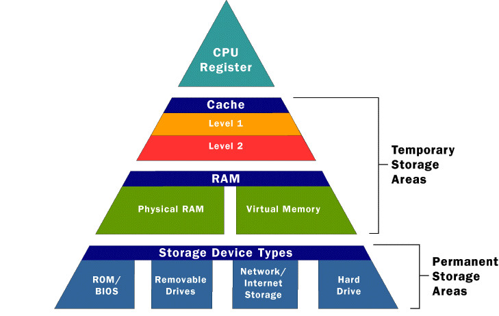
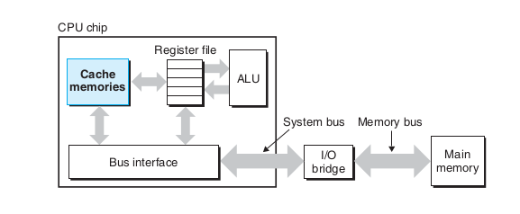
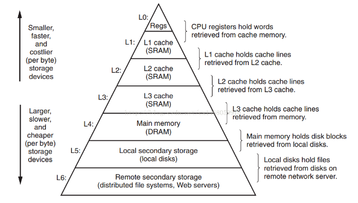

Once again, I'm separating out a topic in it's own file, primarily because it's an important topic.

## Caches

Caches can be thought of as not-so-important-temporary-storages. Contrary to what the name I gave them may suggest, these caches themselves are very important. You may think of them as pockets of your coat. They store whatever is needed for quick access. Similar to coat pockets, the caches are not as big of storage units. You won't carry around a car in your coat pocket. 

Let's consider the `hello` program from [[A Tour of Computer Systems]]. The machine instructions in the `hello` program are originally stored on disk. When the program is loaded, these instructions (and data used by the program like the string: `"hello, world\n"`) are copied from the main memory into the processor. In production, from a programmer's perspective these copy-operations presents itself as an overhead that slows down the program's effective work, the "real work". Thus, _a major goal of system designers is to make these operations run as fast as possible_. It is important to note that due to physical laws, larger storage devices are slower than smaller storage devices. A typical register file stores _a few hundred bytes_ of information, as opposed to billions of bytes in the main memory, but the processor can read data from the register file almost 100 times faster than from memory.

Once again, it's useful to use the coat analogy. A pocket knife is a very useful tool to have at a moments notice, but if you'd store it in your house, you'd need to make a rount trip just to go get it and then use it wherever it is needed. Thus, the coat pockets provide a mini-storage space so that you may carry it wherever you need it for quicker access.

***NOTE***: As semiconductor technology progresses over the years, this processor-memory gap continues to increase. Thus, it is easier and cheaper to make processors run faster than it is to make main memory run faster.

To deal with the processor-memory gap, system designers include smaller and faster storage devices called _cache memories_ (or simply _caches_) that serves as temporary staging areas for information that the processor is likely to need in the near future.

Here's an overview of what the storage hirearchy looks like:

The following shows cache memories in a typical system.

As you can probably guess by looking at the memory pyramid, _cache_ memory is divided into _L1 cache_ and _L2 cache_ ("_L1_ and _L2_" standing for "_level-1 and level-2_" respectively). 

An _L1 cache_ on the processor chip holds tens of thousands of bytes and can be accessed nearly as fast as the register file. A larger _L2 cache_ with hundreds of thousands to millions of bytes is connected to the processor by a special bus. It might take the processor 5 times longer to access the _L2 cache_ compared to the _L1 cache_ but it's still 5-10 times faster than main memory. The _L1_ and _L2_ caches are implemented with hardware technology known as: **static random access memory (SRAM)** . Newer and more powerful processors have 3 levels of cache, _L3_ being the latest.

The idea behind caching is that a system can get the effect of a very large memory and a very fast one by exploiting _locality_, the tendency for programs to access data and code in localized regions. Thus, by exploiting the cache memory, we can improve the efficiency and performance of programs by _orders of magnitude_. 

## The Storage Hierarchy

The diagram from the previous section gives a very visually pleasing overview of what the storage hirearchy looks like. The notion of inserting a smaller, faster storage device to bridge the gap between the processor and larger slower memory turns out to be a general notion. As we move from the top of the hierarchy to the bottom, the devices become slower, larger, and _less costly per byte._

The main idea of a memory hirearchy is that storage at one level serves as a cache for storage at the next lower level. Here's the full storage hirearchy:

