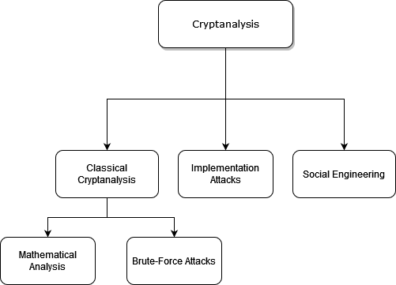

It is important to note that, _a cipher should be secure even if an attacker somehow knows the details of the algorithm_.

In general, cryptanalysis splits into several subsections and branches:

#### Classical Cryptanalysis
This branch is understood as the _science of recovering the plaintext ` x ` from the ciphertext ` y `, or alternatively, recovering the key ` k ` from the ciphertext ` y `_.

This is further divided into mathematical analysis and brute force attacks.

#### Implementation Attacks