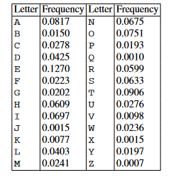

# Basics
Symmetric cryptographic schemes are also referred to as _symmetric-key_, _secret-key_,  and _single-key_ schemes or algorithms. 

Symmetric cryptography is best introduced with an easy to understand problem: There are two users, Alice and Bob, who want to communicate over an insecure _channel_

The term: _channel_ can refer to any sort of a communication link. This can be the internet, a stretch of air in case of mobile phones or wireless LAN and so on. The problem starts with Oscar, whi has access to the channel, for instance, by hacking into an internet router or by listening to radio signals of a Wi-Fi communication. (This type of unauthorized listening is called _eavesdropping_).

In this situation, cryptography offers a powerful solution: Alice encrypts her message ` x ` using a symmetric algorithm, yielding the ciphertext ` y `. Bob receives the ciphertext and decrypts the message. _Decryption is, thus, the inverse process of encryption_.

There are a few important values in this figure:
- ` x ` is called _plaintext_  or _cleartext_.
- ` y ` is called _ciphertext_
- ` k ` is called the _key_
- The set of all possible keys is called the _key space_.

==The system needs a secure channel for distribution of the key== between Alice and Bob. The secure channel shown in Figure 1.5 can, for instance, be a human who is transporting the key in a wallet between Alice and Bob. In any case, the key has only to be transmitted once between Alice and Bob and can then be used for securing many subsequent communications. 

One important and also counterintuitive fact in this situation is that both the encryption and the decryption algorithms are publicly known. It seems that keeping the _encryption algorithm_ secret should make the whole system harder to break. However, secret algorithms also mean untested algorithms: The only way to find out whether an encryption system/method is strong (i.e. just throw it to the hounds and see if it survives).

***Remarks***:
1. 1. Of course, if Oscar gets hold of the key, he can easily decrypt the message since  the algorithm is publicly known. Hence it is crucial to note that the problem of  transmitting a message securely is reduced to the problems of transmitting a key  secretly and of storing the key in a secure fashion.
2. In this scenario we only consider the problem of confidentiality, that is, of hiding  the contents of the message from an eavesdropper. There are many other things we can do with cryptography, such as preventing  Oscar from making unnoticed changes to the message (_message integrity_) or  assuring that a message really comes from Alice (_sender authentication_).

# Simple Symmetric Encryption: The Substitution Cipher

_Substitution cipher_ (also known as _replacement cipher_) is one of the simplest methods of encrypting text. The goal of the substitution cipher is the encryption of _text_ (as opposed to _bits_ in modern digital systems).

The _substitution table_ is the _key_ for substitution cipher. It maps each character to be encoded to another character from the same set so as to have the said character be replaced when the encryption takes place.

For an example, for the English language, we can make a substitution table by randomly choosing a letter for another (without repetition). 

This sure does look like decent cryptography. _However, the substitution cipher is not secure at all!_. There are several ways to break this cipher...

## First Attack: Brute-Force or Exhaustive Key Search
_Brute-Force_ attacks are based on a very simple concept: Oscar has the ciphertext from some source (example: eavesdropping) and happens to have a short piece of plaintext, e.g., the header of a file was encrypted. Oscar now, can simply decrypts the first piece of ciphertext with _all possible keys_. 

If the resulting plaintext matches the short piece of plaintext,  he knows that he has found the correct key.

***Definition 1.2.1*** Basic Exhaustive Key Search or Brute Force Attack:
_Let $(x,\ y)$ denote the pair of plaintext and ciphertext, and let $K\ =\ \{k_{1,}...k_{k}\}$ be the key space of all possible keys $k_{i}$ . A brute-force attack now checks for every $k_{i}\ \in\ K$ if _
$$
d_{k_{i}} (y)\ \stackrel{?}{=}\ x
$$
If the equality holds, a possible correct key is found; if not, proceed with the next key.

In practice, a brute-force attack can be more complicated because incorrect keys can give false positive results. It is important to note that a brute-force attack against symmetric ciphers is always possible in principle. Whether it is feasible in practice depends on the key space, i.e., on the number of possible keys that exist for a given cipher. If testing all the keys on many modern computers takes too much time, i.e., several decades, the cipher is computationally secure against a brute-force attack.

***NOTE***: This explanation/cipher technique basically assumes that there exists no single element in the key-space which is the same on both ends i.e. the key and what it represents cannot be the same. 

***Remark***: Since we're just talking about text in English language for this topic we can also lock the length of the key-space to a fixed constant. By this simple observation we can say that the strength the replacement cipher depends on the language it is implemented in.

The key-space of substitution cipher for English alphabet is $\approx 2^{88}$ (i.e. $26!$). Even with hundreds of thousands of high-end PCs such a search would take several decades. We're thus tempted to conclude that this kind of cipher is secure. However, this is incorrect because there exists a more powerful attack.

## Second Attack: Letter Frequency Analysis

The major weakness of the cipher is that each plaintext character/symbol always maps to the same ciphertext symbol. ==This means that the statistical properties of the plaintext are preserved in the ciphertext==. If we consider an example, and determine the frequencies of each of the letters in the ciphertext, we can be confident that the most frequent letters correspond to the most frequent letters in the plaintext as well as the most frequent letters used in the English language.  

For practical attacks, here are some properties of language that can be exploited:

1. Determine the frequency of every ciphertext character letter. The frequency distribution will be close to that of the given language in general. For example, in the English language, the letter ` E ` is the most frequent letter ($\approx$ 13%), this property will be preserved in the ciphertext. So we can be sure that whatever letter represents ` E ` in the ciphertext will also have a frequency of $\approx$ 13%.
2. The method above can be generalized by looking at pairs of triples, or larger groups of ciphertext symbols. For instance, in English, the letter ` Q ` is almost always followed by ` U `. This behavior can be used to detect the substitution of the letters ` Q ` and ` U `.
3. If we assume whitespaces (blanks and newlines) have been found (which is not common), one can often detect frequent short words like `the`, `and`, etc. Once we have identified these words, we instantly know the plaintext to ciphertext mapping of the letters in these words.

 Here's a table showing the letter frequencies of the letters in English Language:

The takeaway from this section is that ==Good ciphers are the ones that hide statistical properties of the encrypted plaintext. The ciphertext symbols should appear to be random==. Furthermore, ==A large key-space alone is not sufficient for a strong encryption==. 

