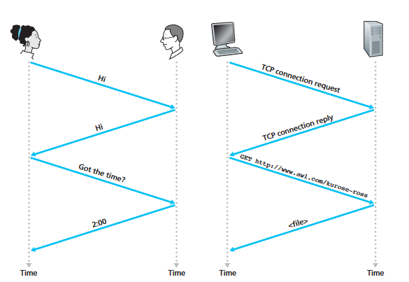

***Definition***: A _protocol_ defines the format and the order of messages exchanged between two or more communicating entities, as well as the actions taken on the transmission and/or receipt of a message or other event.[^1]

All activity in the Internet that involves two or more communicating remote entities is governed by a protocol. For example, hardware-implemented protocols in two physically connected computers control the flow of bits on the “wire” between the two network interface cards; _congestion-control protocols_ in end systems control the rate at which packets are transmitted between sender and receiver; protocols in routers determine a packet’s path from source to destination.

Here's a great analogy for understanding the above mentioned:

There are several more aspects to network protocols than stated in this simple diagram, like acknowledgement of connections, checksums and so on. However, for understanding the basic idea of protocols, this diagram suffices. 

The primary takeaway of this section is that: _Computer networks in general make extensive use of protocols_.

[^1]: It's important to note that this particular definition of the word _protocol_ corresponds to _network protocols_.
